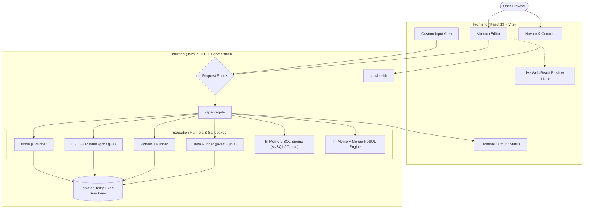

# ProPlacement Online Compiler & Web Playground

<div align="center">


**Practice • Prepare • Get Placed**

*A modern, full-stack, multi-language Online Compiler, Database Playground, and Web Sandbox designed for placement preparation, competitive programming, and rapid code prototyping.*

</div>

---

## Overview

**ProPlacement Online Compiler** is a lightweight, high-performance web-based IDE that allows students and developers to write, compile, run, and preview code across 9+ programming languages, databases, and frontend environments right inside their browser.

Built with a fast, zero-dependency **Java HTTP backend** with process sandboxing and custom in-memory SQL/NoSQL engines, paired with a sleek **React 19 + Monaco Editor** frontend with dark/light theming.

---

##  Key Features

### Multi-Language & Multi-Engine Support
* **Java 21**: Automatic class detection, compilation with `javac`, and sandboxed execution via `java`.
* **Python 3**: Rapid execution via Python interpreter with STDIN support.
* **C++ (C++20)** & **C (C11)**: Compiled and executed natively with `g++` / `gcc`.
* **JavaScript (Node.js 20)**: Server-side JS execution with Node.js runtime.
* **MySQL 8.0**: Built-in in-memory SQL engine supporting `CREATE TABLE`, `INSERT`, `SELECT`, `WHERE`, `ORDER BY`, and `GROUP BY`.
* **Oracle SQL (21c)**: Built-in schema & query engine with Oracle SQL*Plus syntax support.
* **MongoDB 7.0**: Built-in document/NoSQL engine with `insertMany`, `find`, filtering (`$gte`, etc.), and aggregation pipelines (`$match`, `$group`, `$sort`).
* **React.js Interactive Playground**: Live client-side React component preview (`App.jsx`) with Babel standalone in-browser compilation.
* **HTML / CSS / JS Sandbox**: Live browser DOM sandbox preview (`index.html`) with instant rendering.

---

### Modern UI & Developer Experience
* **Dark & Light Mode**: One-click instant theme toggle across the Monaco Editor, navigation bar, and output terminal.
* **Keyboard Shortcut**: Run any code instantly with <kbd>Ctrl</kbd> + <kbd>Enter</kbd> (or <kbd>Cmd</kbd> + <kbd>Enter</kbd> on macOS).
* **Monaco Editor Power**: Syntax highlighting, bracket matching, line numbering, auto-indentation, and dynamic language-specific filenames (e.g. `Solution.java`, `solution.py`, `query.sql`, `App.jsx`).
* **Interactive STDIN Input**: Custom input console for competitive programming and interactive CLI programs.
* **Execution Metrics & Health Monitoring**: Live compile time, execution time, exit codes, and real-time backend health check status indicator.
* **Productivity Actions**: One-click **Copy Code**, **Copy Output**, **Clear Output**, **Reset Template**, and **Download File** with matching language extensions.

---

## System Architecture



---

## Project Structure

```text
ProPlacement Online Compiler/
├── backend/
│   ├── JavaCompilerServer.java          # Java HTTP server, multi-language compiler & in-memory DB engines
│   ├── JavaCompilerServer.class         # Compiled server class
│   ├── temp_exec/                       # Sandboxed temporary execution directories (auto-cleaned)
│   └── tools/                           # Optional native tools & compilers
│
├── frontend/
│   ├── index.html                       # Frontend entry HTML
│   ├── package.json                     # Frontend dependencies & scripts
│   ├── vite.config.js                   # Vite configuration
│   ├── src/
│   │   ├── main.jsx                     # React root mount
│   │   ├── App.jsx                      # Main application state & split layout
│   │   ├── App.css                      # Layout styling
│   │   ├── index.css                    # Design tokens & global CSS
│   │   ├── components/
│   │   │   ├── Navbar.jsx               # Header, language selector, run/theme buttons
│   │   │   ├── CodeEditor.jsx           # Monaco Editor wrapper
│   │   │   ├── ConsoleOutput.jsx        # Terminal output display with execution stats
│   │   │   └── WebPreview.jsx           # Sandboxed iframe preview for React/HTML
│   │   └── utils/
│   │       └── defaultTemplates.js      # Starter templates for all 9+ languages
│
├── scratch/                             # Integration & test scripts
├── LICENSE                              # MIT License
└── README.md                            # Project documentation
```

---

## Prerequisites

* **Java Development Kit (JDK)**: Java 17 or Java 21+ installed and configured on your `PATH`.
* **Node.js**: v18+ and `npm` installed.
* *(Optional for native compilation)*:
  * **Python 3**: For running Python solutions (`python --version`).
  * **GCC / G++ (MinGW on Windows / GCC on Linux/macOS)**: For C/C++ compilation.

---

## Quick Start Guide

### 1. Clone the Repository
```bash
git clone https://github.com/ghavate-n11/ProPlacement-Online-Compiler.git
cd "ProPlacement Online Compiler"
```

### 2. Start the Backend Server
```bash
cd backend
javac -encoding UTF-8 JavaCompilerServer.java
java -Dfile.encoding=UTF-8 JavaCompilerServer
```
> Server will start listening on `http://localhost:8080` with endpoints `/api/health` and `/api/compile`.

### 3. Start the Frontend Application
In a new terminal window:
```bash
cd frontend
npm install
npm run dev
```
> Frontend will launch at `http://localhost:5173`. Open your browser and start coding!

---

## API Reference

### Health Check
- **Endpoint**: `GET /api/health`
- **Response**:
```json
{
  "status": "OK",
  "javaVersion": "21.0.x"
}
```

### Compile & Execute Code
- **Endpoint**: `POST /api/compile`
- **Headers**: `Content-Type: application/json`
- **Request Body**:
```json
{
  "code": "public class Solution { public static void main(String[] args) { System.out.println(\"Hello World\"); } }",
  "language": "java",
  "input": ""
}
```
- **Response Body**:
```json
{
  "status": "SUCCESS",
  "output": "Hello World\n",
  "error": "",
  "compileTimeMs": 240,
  "executionTimeMs": 65,
  "exitCode": 0
}
```

---

## Shortcuts & Controls

| Action | Shortcut / Control |
| :--- | :--- |
| **Run Code** | <kbd>Ctrl</kbd> + <kbd>Enter</kbd> (or <kbd>Cmd</kbd> + <kbd>Enter</kbd>) / **Run** Button |
| **Toggle Dark / Light Theme** | Click Theme Icon in Navbar |
| **Copy Code / Output** | Quick copy button in Editor & Console headers |
| **Download Code** | Download button in Navbar (auto-names with extension) |
| **Clear Console** | Clear button in Console header |
| **Interactive Web Preview** | Auto-switches to live iframe when React or HTML is selected |

---

## Security & Isolation

- **Timeout Protection**: All subprocess execution jobs are capped at a strict 7-second runtime limit to prevent infinite loops and resource starvation.
- **Isolated Job Directories**: Each execution request is assigned a unique UUID sandbox directory under `temp_exec/` which is automatically deleted after output collection.

---

## License

This project is licensed under the **MIT License** - see the [LICENSE](file:///c:/MAJOR%20PROJECT/ProPlacement%20Online%20Compiler/LICENSE) file for details.

---

<div align="center">
  <b>Built for campus placement prep, interviews, and coding excellence 🎯</b>
</div>
